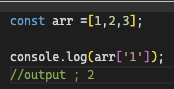

# number 인덱스 시그니처보다는 Array, 튜플 사용

자바스크립트에서 (객체)object는 키와 값의 쌍으로 구성
자바스크립트 엔진에서는 object의 키는 string 타입 혹은 symbol 타입만이 가능합니다.

따라서, 배열에서도 number 타입의 key로 접근하는 것이 불가능하다.
다만, 엔진에서 자동으로 형변환이 되기에 number 타입의 키로도 접근 가능하다
`arr[0] 은 내부적으로 arr['0']으로 바뀜`

```ts
const arr = [1, 2, 3];
Object.keys(arr); // ['1',2','3'];
```

따라서, 엄격하게 보자면, string을 해서만 배열의 원소에 접근이 가능하다.
그러나 범용적으로 number타입의 키를 통해 배열의 원소에 접근했기 때문에 타입스크립트도 number 타입의 키를 허용함

`lib.es5.d.ts에 선언된 인터페이스`

인터페이스를 보면 number 타입만 키로 허용하고 있음.
`이건 버그를 잡기 위한 순수 타입스크립트 코드라고 함`


`??? 근데 막상 돌리면 잘 나옴? `

아무튼 물론 실제 자바스크립트 런타임에서는 위에서 설명한 것처럼 string 타입으로 형변환이 됩다고 함

### 요약

- 배열은 객체이므로 키는 숫자가 아니라 문자열임
