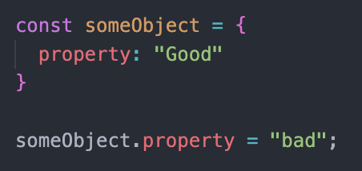
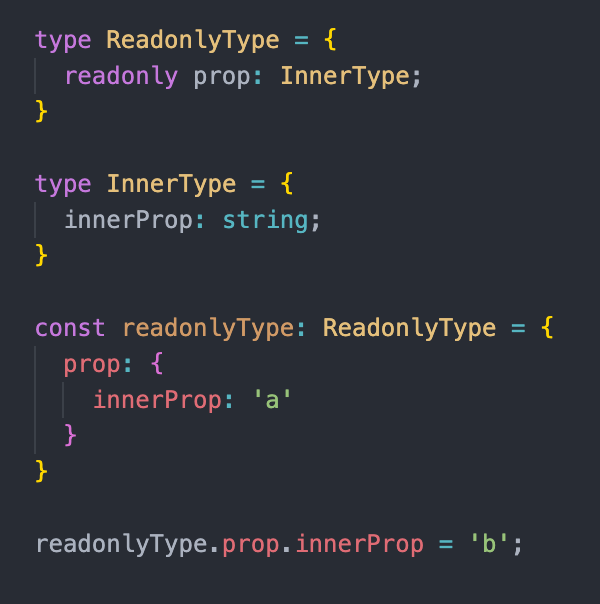
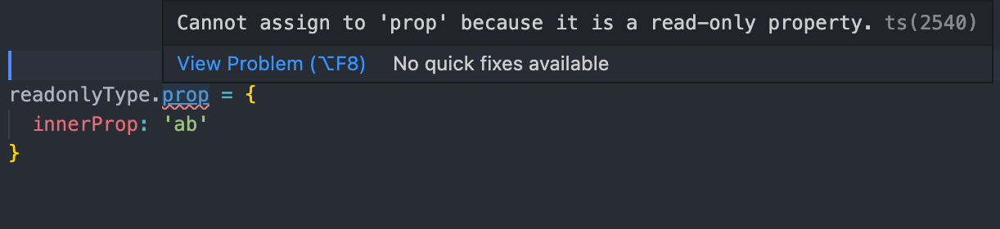
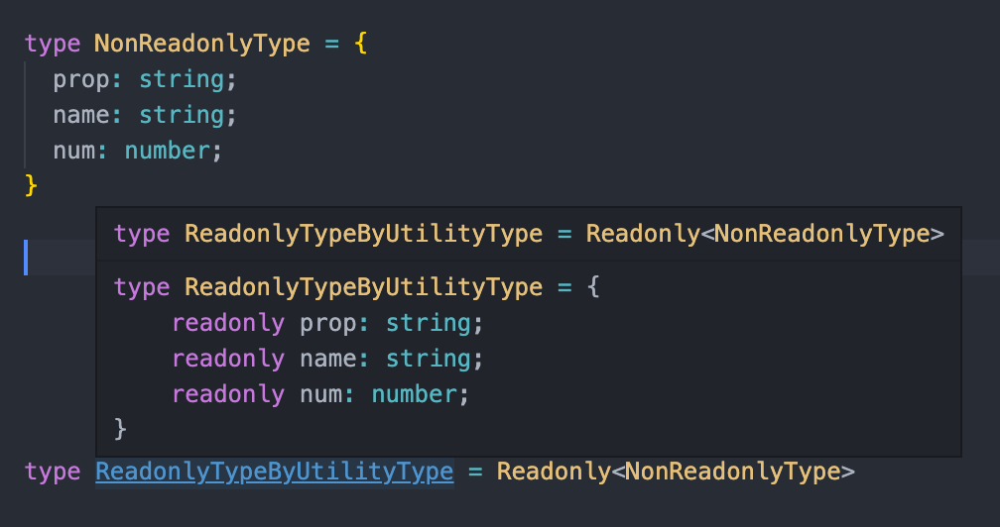

# 변경 관련된 오류 방지를 위해 readonly 사용하기

### 객체 타입 Property 앞에 붙는 readonly

- 자바스크립트에서 상수 키워드인 const 키워드는 재할당을 금지하는 키워드

하지만 const로 선언된 객체의 속성은 바꿀 수 있다

`const로 선언된 객체는 식별자에 다른 객체를 할당 할 수 없지만, 객체의 속성의 변경은 가능`

`즉, 재할당 가능과 객체의 속성 변경 가능은 서로 독립적이다`
Object.freeze를 사용하면 객체 속성의 변경을 막을 수 있다

tyepscript 에서는 `readonly`를 통해 특정 속성의 변경을 막을 수 있다
`readonly 적는 제어자가 얕게(shallow) 동작한다`




- readonlyType.prop.innerProp 속성은 변경 가능하다
- readonlType.prop 속성은 변경 불가능하다

props는 readonly가 있기 때문에 속성 변경이 불가능하다
하지만 innerPropsms readonly가 아니기에 변경이 가능하다

이럴때는 `유틸리티 타입의 Readonly를 사용하면 된다`


Readonly의 코드는 이렇게 생겼다

```ts
type Readonly<T> = {
  readonly [P in keyof T]: T[P];
};
```

### 배열과 튜플 앞에 붙은 readonly 특징

- 배열의 요소를 읽을 수는 있으나, 추가하거나 변경 할 수 없다
- 배열을 변경하는 pop, push 등을 사용할 수 없다
- length는 사용이 가능하다
